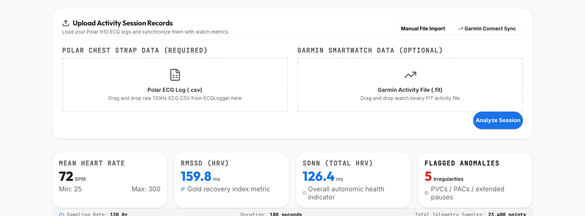
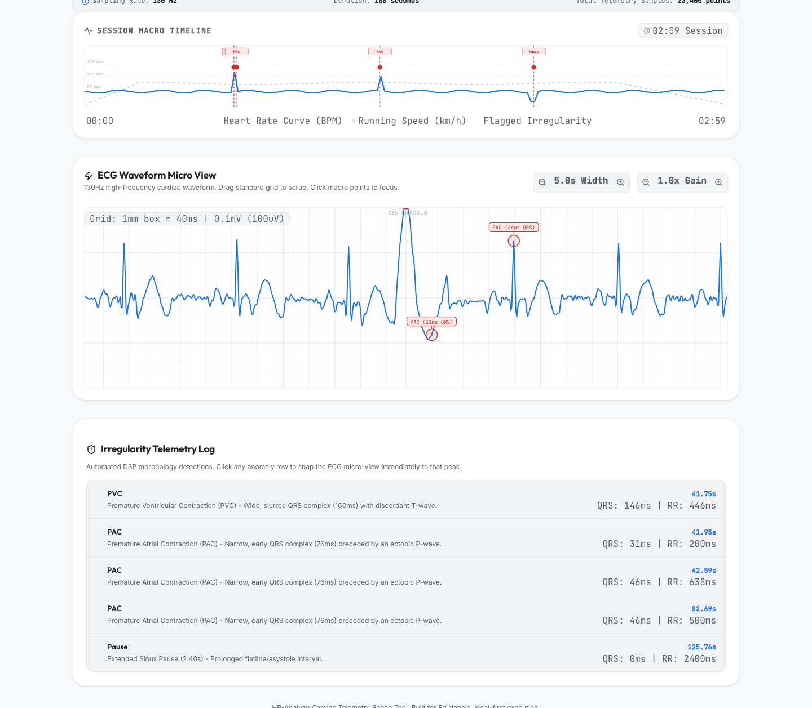

# hr-analyze

A local-first telemetry visualizer and digital signal processing dashboard designed to parse, filter, and inspect raw ECG logs from a Polar H10 chest strap, with optional synchronization for Garmin activity records. 

Built specifically to support recovery tracking and cardiac rehabilitation, this tool runs entirely on your local machine to keep sensitive physiological data completely private.

---

## Previews



*High-frequency ECG micro grid and interactive cardiac anomaly log.*



*Draggable session macro timeline with heart rate profiles and pacing charts.*

---

## System Capabilities

### 1. Data Parsers
* **Polar H10 ECG CSV:** Parses high-frequency Polar telemetry (sampled at ~130 Hz). Standardizes input amplitude scales automatically by detecting whether values are logged in millivolts (mV) or microvolts (uV) and converting them to a unified uV scale.
* **Garmin FIT:** Extracts second-by-second activity stats (heart rate, pace, GPS coordinates, elevation) and high-resolution beat-to-beat RR intervals (HRV) from binary `.fit` records.

### 2. Digital Signal Processing (DSP)
* **Zero-Phase Bandpass Filtering:** Applies a zero-phase 3rd-order Butterworth bandpass filter ($0.5\text{ Hz} - 40\text{ Hz}$) to remove high-frequency muscle noise and low-frequency baseline wander caused by breathing movement.
* **Pan-Tompkins QRS Detection:** Analyzes the filtered signal via derivative, squaring, and moving-average integration windows to locate R-peaks, calculate heart rate, and extract HRV parameters (RMSSD and SDNN).
* **Cardiac Irregularity Rules:** Uses QRS complex width (in milliseconds) and RR intervals to classify anomalies:
  * **Premature Ventricular Contractions (PVCs):** Characterized by a wide, slurred QRS complex ($>120\text{ ms}$) and a premature interval followed by a compensatory pause.
  * **Premature Atrial Contractions (PACs):** Characterized by an early, narrow QRS complex ($<100\text{ ms}$).
  * **Extended Pause:** Flagged when an RR interval exceeds $2.0$ seconds or $1.8\times$ the local average.

### 3. Multi-Device Timeline Synchronization
* **Clock Drift Correction:** Since phone recorders and sports watches frequently have minor clock lag, the backend calculates the cross-correlation of their heart rate profiles over the session. It determines the time offset and automatically shifts the ECG timestamps to align with the Garmin GPS/pacing track.

### 4. Interactive User Interface
* **HTML5 Canvas Micro ECG Grid:** A custom high-performance canvas that draws standard red/pink medical gridlines ($40\text{ ms}$ horizontal time blocks | $0.1\text{ mV}$ vertical voltage blocks). Allows click-and-drag scrubbing, time zoom, and voltage gain scaling.
* **SVG Macro Timeline:** Renders a continuous, interactive view of the session. Clicking on any flagged cardiac anomaly instantly centers the high-resolution Micro ECG waveform on that exact heartbeat.
* **Onboarding Wizard:** Steps through physical prep, sensor pairing, configuring watch HRV logging, and data export. Progress is saved locally via `localStorage`.

---

## Technical Stack

* **Backend:** Python 3.11, FastAPI, Uvicorn, SciPy, NumPy, Pandas, fitparse
* **Frontend:** React 18, Vite, TypeScript, Lucide Icons, Vanilla CSS (Tailwind-free)

---

## Getting Started

### Prerequisites
* Node.js (v18 or newer)
* npm (v9 or newer)
* Python (v3.11 or newer)
* [uv](https://github.com/astral-sh/uv) (fast Python package installer and manager)

---

### Installation

#### 1. Start the API Backend
1. Navigate to the backend directory:
   ```bash
   cd backend
   ```
2. Initialize and activate a virtual environment:
   ```bash
   uv venv
   source .venv/bin/activate
   ```
3. Install dependencies:
   ```bash
   uv pip install -r requirements.txt
   ```
4. Run the Uvicorn application server:
   ```bash
   uv run uvicorn app.main:app --port 8000 --reload
   ```
   The backend API will be available at `http://127.0.0.1:8000`.

---

#### 2. Start the Frontend Dashboard
1. Open a new terminal window and navigate to the frontend directory:
   ```bash
   cd frontend
   ```
2. Install package dependencies:
   ```bash
   npm install
   ```
3. Launch the development server:
   ```bash
   npm run dev
   ```
4. Open your browser and go to `http://localhost:5173`.

---

## Verification & Testing

To execute the digital signal processing and parser test suite:
```bash
cd backend
uv run test_backend.py
```

---

## Repository Structure

```
hr-analyze/
├── backend/
│   ├── app/
│   │   ├── dsp.py          # Butterworth filtering, QRS peak detection, anomaly classification
│   │   ├── main.py         # FastAPI endpoints, synthetic demo signal generator
│   │   └── parsers.py      # Polar CSV and Garmin FIT file parsing
│   ├── requirements.txt    # Python requirements
│   └── test_backend.py     # Backend test script
├── frontend/
│   ├── src/
│   │   ├── components/
│   │   │   ├── EcgCanvas.tsx       # HTML5 ECG waveform grid canvas
│   │   │   ├── MacroTimeline.tsx   # SVG session heart rate scrubber
│   │   │   └── OnboardingWizard.tsx # Hardware prep and export instructions
│   │   ├── App.tsx         # Dashboard core coordinator
│   │   └── index.css       # custom responsive dark theme stylesheet
│   ├── package.json        # Frontend dependencies
│   └── vite.config.ts      # Vite build configuration
├── assets/                 # Telemetry dashboard screenshots
├── PRD.md                  # Product Requirements Document
├── TDD.md                  # Technical Design Document
└── README.md               # User guide and technical overview
```

---

## Disclaimer

This software is a telemetry visualization and signal processing tool. It is not an FDA-approved medical device and is not designed to diagnose, treat, prevent, or cure any cardiovascular condition. Always consult with your cardiologist or primary care physician before making changes to your post-rehabilitation exercise regimen.
