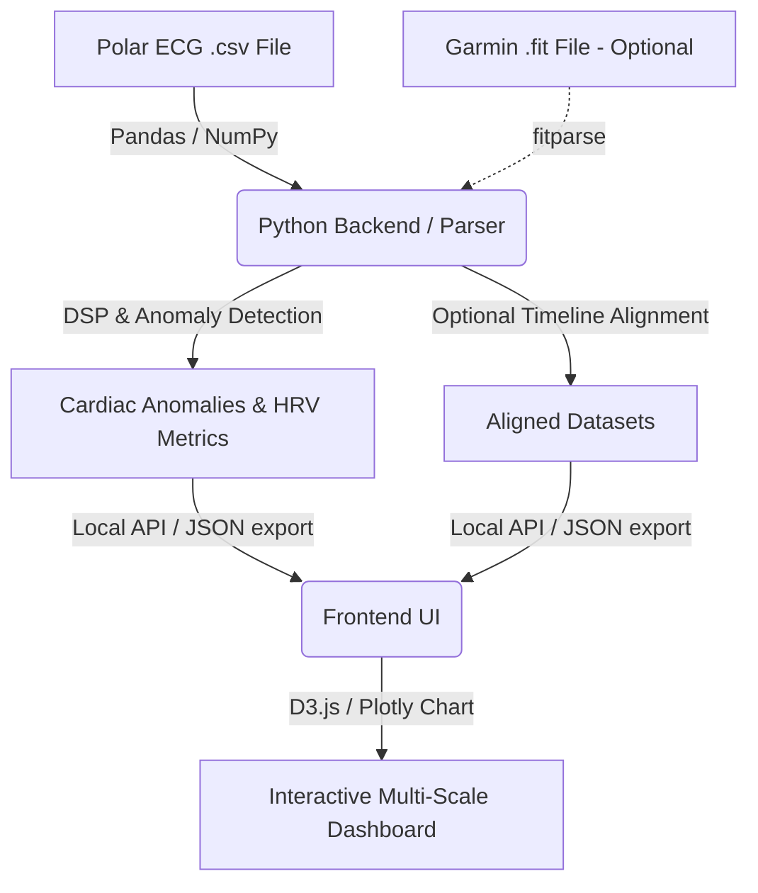

# Technical Design Document (TDD): HR-Analyze

## 1. Architecture Overview

To achieve local-first processing, high performance, and ease of use, the application is divided into two primary tiers:
1. **Analysis Engine (Python):** Handles raw ECG signal processing, anomaly detection, and optional binary `.fit` parsing and timeline alignment.
2. **Dashboard UI (HTML5 / Modern JavaScript):** A premium interactive dashboard that visualizes the timelines and lets the user explore their cardiac sessions.



---

## 2. Technology Stack & Libraries

### 2.1 Backend / Parser
- **Language:** Python 3.14.3 (system verified)
- **Environment Management:** `uv` (Rust-based ultra-fast package installer and virtual environment manager)
- **Key Libraries:**
  - `fastapi` & `uvicorn`: Web framework and server for local API routing.
  - `fitparse`: Python library for parsing the Garmin binary FIT protocol.
  - `numpy` & `pandas`: Vectorized manipulation of high-frequency timeseries data.
  - `scipy`: Digital signal processing (e.g., bandpass filtering of raw ECG to remove baseline wander and muscle noise).

### 2.2 Frontend UI
- **Framework:** Vanilla HTML5, CSS3, and Modern ES6+ JavaScript, or a lightweight Vite + React app for component state management.
- **Styling:** Custom CSS implementing modern glassmorphism, responsive flex/grid layouts, vibrant HSL gradients, and dark-mode styling.
- **Charts:**
  - **D3.js** or **Plotly.js**: Highly optimized libraries for rendering dense scatter plots and line charts. D3 is preferred for downsampling large datasets dynamically to avoid browser performance drops.

---

## 3. Data Processing Pipelines

### 3.1 [Optional] Garmin FIT File Extraction
If a Garmin `.fit` file is provided, the system parses the binary streams to extract:
1. **`record` messages:** Contain `timestamp` and `heart_rate` (sampled once per second).
2. **`hrv` messages:** Contain lists of `time` values representing the millisecond interval between consecutive heartbeats (RR intervals).

### 3.2 Polar H10 ECG CSV Processing (Required)
ECGLogger exports a CSV file typically structured as:
```csv
timestamp,ecg_uV
1716990000000,-15
1716990000007,-22
```
*Note: ECG is sampled at 130Hz, meaning 1 point every ~7.69 milliseconds.*

### 3.3 [Optional] Timeline Synchronization & Alignment
If both a Garmin watch `.fit` file and a Polar ECG `.csv` file are uploaded, the application will correct for clock drifts (typically 1–10 seconds) between the two devices using:
- **Normalized Cross-Correlation:** Compute a rolling heart rate (BPM) from the raw ECG's R-peaks, then calculate the cross-correlation between this ECG-derived HR and the Garmin FIT HR. The lag that maximizes cross-correlation is used to adjust the ECG timeline.
If no Garmin `.fit` file is uploaded, the app bypasses synchronization and plots/analyzes the ECG timeline directly.

---

## 4. Signal Processing & Irregularity Detection

To detect anomalies like Premature Ventricular Contractions (PVCs) and ectopic beats:

### 4.1 ECG Bandpass Filter
Raw ECG is susceptible to:
- **Baseline Wander (low frequency):** Caused by breathing and movement. Corrected using a Butterworth high-pass filter ($0.5\text{ Hz}$).
- **High-Frequency Noise:** Powerline interference ($50\text{/}60\text{ Hz}$) and muscle contractions. Corrected using a low-pass filter ($40\text{ Hz}$).

### 4.2 QRS Detection & Anomaly Rules
1. **Pan-Tompkins Algorithm:** Used to detect the R-peaks in the filtered ECG waveform, yielding highly accurate beat timestamps.
2. **RR Anomaly Rule:** If a beat's RR interval is $< 80\%$ of the rolling average RR interval, followed by a compensatory pause (longer RR interval), it is flagged as a premature beat (PVC or PAC).
3. **QRS Width Rule:**
   - **PAC (Premature Atrial Contraction):** Narrow QRS complex (normal morphology).
   - **PVC (Premature Ventricular Contraction):** Wide, bizarre QRS complex ($> 120\text{ ms}$ width) due to abnormal ventricular conduction. The algorithm measures the width of the flagged QRS complex to categorize the ectopic beat.

---

## 5. UI/UX Design System

### 5.1 Palette (Dark Theme)
- **Background:** `#0d0f12` (Deep Obsidian)
- **Card Background:** `rgba(22, 26, 32, 0.7)` with `backdrop-filter: blur(12px)`
- **Border:** `rgba(255, 255, 255, 0.08)`
- **Accent Active:** `#00f2fe` (Neon Cyan) to `#4facfe` (Vibrant Blue) gradient
- **Warning/Anomaly:** `#ff5e62` (Electric Coral)

### 5.2 Responsive Layout
- **Left Sidebar:** File Uploader, overall session stats, and irregularity counts.
- **Top Main Card:** The full run session HR timeline with draggable brush selector.
- **Bottom Main Card:** The zoomed-in raw ECG grid with anomalous beats color-coded in Electric Coral.

### 5.3 Onboarding Wizard Component (Step-by-Step Setup UI)
To guide the user through physical setup and file export, a specialized wizard will be built into the frontend:
- **State Management:** A step-by-step progress index (`currentStep: 1..4`) backed by `localStorage` persistence. The user can resume where they left off.
- **Visual Design:** An interactive horizontal stepper at the top of the interface. Each step is represented by a card with:
  - Step Title & High-impact instructions.
  - Custom SVG graphics or diagrams demonstrating the action (e.g., watch menu sequence, phone screen layout).
  - Expandable "Troubleshooting & Advanced Tips" dropdown (e.g., explaining custom Garmin file copy if "Log HRV" is hidden).
  - A clear "Mark as Completed" button.
- **Interactive Dry Run (Sample Session):**
  - To let the user explore the application immediately without exporting their own data first, the wizard will feature a prominent **"Load Demo Activity"** button. This will inject pre-bundled, synchronized Garmin FIT and Polar H10 CSV datasets into the application's memory, demonstrating the full multi-scale visualization and irregularity flagging features instantly.

