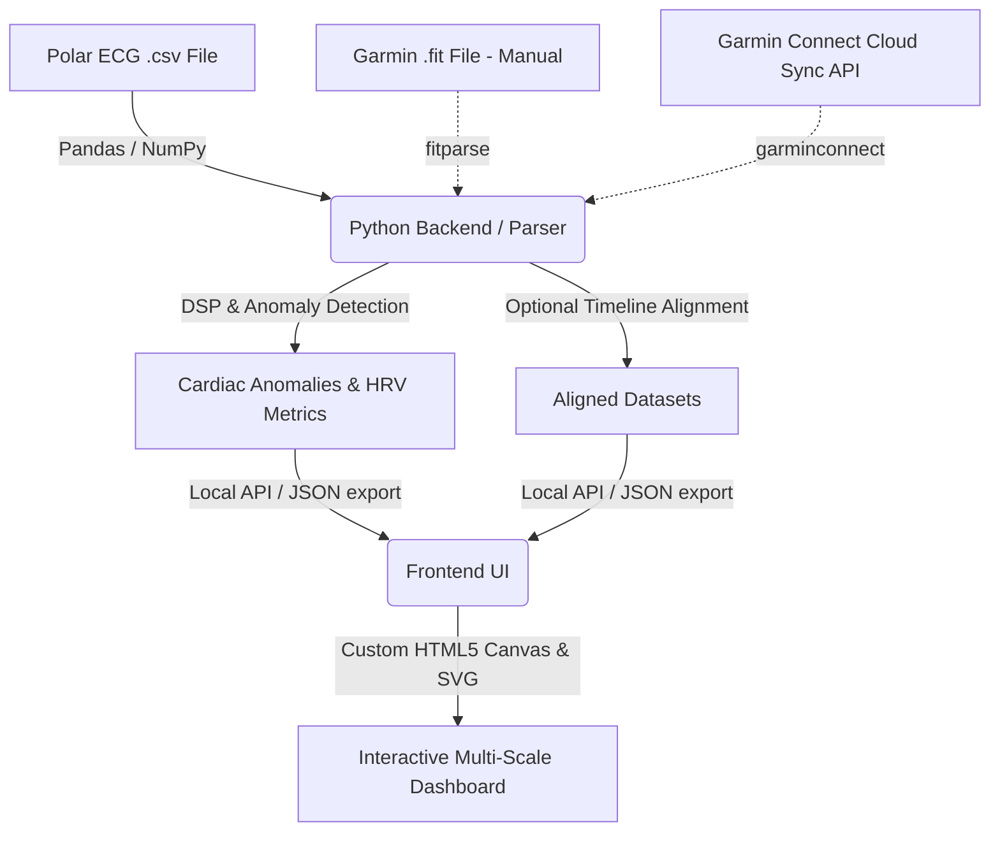

# Technical Design Document (TDD): HR-Analyze

## 1. Architecture Overview

To achieve local-first processing, high performance, and ease of use, the application is divided into two primary tiers:
1. **Analysis Engine (Python):** Handles raw ECG signal processing, anomaly detection, and optional binary `.fit` parsing, Garmin Connect Cloud API synchronization, and timeline alignment.
2. **Dashboard UI (React / TypeScript):** A premium interactive dashboard that visualizes the timelines and lets the user explore their cardiac sessions using hardware-accelerated rendering.



---

## 2. Technology Stack & Libraries

### 2.1 Backend / Parser
- **Language:** Python 3.11+
- **Environment Management:** `uv` (Rust-based ultra-fast package installer and virtual environment manager)
- **Key Libraries:**
  - `fastapi` & `uvicorn`: Web framework and server for local API routing.
  - `fitparse`: Python library for parsing the Garmin binary FIT protocol.
  - `garminconnect`: Python client wrapper for the Garmin Connect cloud APIs.
  - `numpy` & `pandas`: Vectorized manipulation of high-frequency timeseries data.
  - `scipy`: Digital signal processing (e.g., bandpass filtering of raw ECG to remove baseline wander and muscle noise).

### 2.2 Frontend UI
- **Framework:** Vite + React 18 + TypeScript.
- **Styling:** Custom Vanilla CSS (Tailwind-free) implementing a premium warm clinical light theme matching Google Health Connect (Material Design 3).
- **Charts & Visualization:**
  - **HTML5 Canvas (`EcgCanvas.tsx`):** A custom, highly optimized high-frequency waveform drawing module. It renders standard clinical red/pink ECG gridlines and plots 130Hz microvolt trace lines using hardware-accelerated canvas contexts. This guarantees smooth 60 FPS interactions and click-and-drag scrubbing.
  - **Interactive SVG (`MacroTimeline.tsx`):** Renders the full session heart rate curve, pace/speed tracks, and anomaly markers. It supports brush selections and centers the micro ECG grid instantly when clicked.

---

## 3. Data Processing Pipelines

### 3.1 Garmin FIT File Extraction (Manual & Cloud Sync)
If Garmin data is provided, the system parses the binary streams (either from a manually uploaded file or dynamically pulled from Garmin Connect cloud APIs) to extract:
1. **`record` messages:** Contain `timestamp` and `heart_rate` (sampled once per second) as well as running speed/pace, GPS coordinates, and elevation.
2. **`hrv` messages:** Contain lists of `time` values representing the millisecond interval between consecutive heartbeats (RR intervals).

### 3.2 Polar H10 ECG CSV Processing (Required)
ECGLogger exports a CSV file typically structured as:
```csv
timestamp,ecg_uV
1716990000000,-15
1716990000007,-22
```
*Note: ECG is sampled at 130Hz, meaning 1 point every ~7.69 milliseconds.*

### 3.3 Timeline Synchronization & Alignment
If both a Garmin activity (watch) and a Polar ECG `.csv` file are active, the application will correct for clock drifts (typically 1–10 seconds) between the two devices using:
- **Normalized Cross-Correlation:** Compute a rolling heart rate (BPM) from the raw ECG's R-peaks, then calculate the cross-correlation between this ECG-derived HR and the Garmin HR profile. The lag offset that maximizes cross-correlation is used to adjust and synchronize the ECG timeline.
If no Garmin activity is active, the app bypasses synchronization and plots/analyzes the ECG timeline directly.

---

## 4. Signal Processing & Irregularity Detection

To detect anomalies like Premature Ventricular Contractions (PVCs) and ectopic beats:

### 4.1 ECG Bandpass Filter
Raw ECG is susceptible to:
- **Baseline Wander (low frequency):** Caused by breathing and movement. Corrected using a 3rd-order Butterworth high-pass filter ($0.5\text{ Hz}$).
- **High-Frequency Noise:** Powerline interference ($50\text{/}60\text{ Hz}$) and muscle contractions. Corrected using a 3rd-order Butterworth low-pass filter ($40\text{ Hz}$).

### 4.2 QRS Detection & Anomaly Rules
1. **Pan-Tompkins Heuristic:** Used to detect the R-peaks in the filtered ECG waveform, yielding highly accurate beat timestamps.
2. **RR Anomaly Rule:** If a beat's RR interval is $< 80\%$ of the rolling average RR interval, followed by a compensatory pause (longer RR interval), it is flagged as a premature beat (PVC or PAC).
3. **QRS Width Rule:**
   - **PAC (Premature Atrial Contraction):** Narrow QRS complex (normal morphology, $< 100\text{ ms}$).
   - **PVC (Premature Ventricular Contraction):** Wide, bizarre QRS complex ($> 120\text{ ms}$ width) due to abnormal ventricular conduction. The algorithm measures the width of the QRS complex to categorize the ectopic beat.
   - **Pause:** Flagged when an RR interval exceeds $2.0$ seconds.

---

## 5. UI/UX Design System

### 5.1 Palette (Google Health Warm Light Theme)
- **Background:** `#f8f9fa` (Warm clinical light grey)
- **Card Background:** `#ffffff` (Elevated clean Material 3 white cards)
- **Border:** `#e2e8f0` / `#f1f3f4`
- **Primary Accent / Active:** `#1a73e8` (Google Blue) with rounded-full pill buttons
- **Warning / Anomaly:** `#d93025` (Material Red) capsules
- **Typography:** Google dark charcoal `#202124` for high contrast text and `#5f6368` for secondary labels.

### 5.2 Responsive Layout
- **Upload Records Section:** Double-card flex heights (`220px`) featuring a slider track tab selector (Manual File Import vs Garmin Connect Sync), verified green checkboxes, and padded rounded-full submit button ("Analyze Session") separated by a top border.
- **Stats Row:** Metric cards showing Mean HR, RMSSD, SDNN, and Flagged Anomaly counts using modern flat Material design.
- **Middle Main Card:** SVG-based interactive session timeline showing heart rate curves and paces with flagged irregularity icons.
- **Bottom Main Card:** The zoomed-in custom Canvas ECG Micro View displaying standard gridlines and ECG traces drawn in high-contrast Google Blue.
- **Bottom Table:** Clinical Irregularity Telemetry Log to snap the ECG micro view directly to the flagged anomaly timestamp.

### 5.3 Onboarding Wizard Component (Step-by-Step Setup UI)
To guide the user through physical setup and file export, a specialized wizard is built into the frontend:
- **State Management:** A step-by-step progress index (`currentStep: 1..4`) backed by `localStorage` persistence. The user can resume where they left off.
- **Visual Design:** An interactive horizontal stepper at the top of the interface. Each step is represented by a card with step titles and troubleshooting instructions.
- **Interactive Demo Mode:** Featured prominently with a **"Load Demo Activity"** button to load a pre-bundled, synchronized Garmin FIT and Polar H10 CSV dataset into the application's state, demonstrating the full visualization and irregularity features instantly without requiring hardware uploads.

---

## 6. Garmin Connect Cloud Integration

To simplify the import pipeline, the backend integrates direct communication with Garmin's cloud servers:
1. **Secured Configuration:** `/api/garmin/config` validates user credentials and manages a local cache file of session cookies. This session caching avoids repeated multi-factor authentication (MFA) requests and bypasses Garmin's rate-limiting blocks.
2. **Activity Enumeration:** `/api/garmin/activities` retrieves the user's latest 10 athletic activities.
3. **Automated Stream Parsing:** When an activity is selected, the backend downloads the `.fit` file directly, decompresses the zip container in memory, extracts second-by-second pacing, HRV, and heart rate telemetry, and matches it with the high-resolution Polar CSV data.
